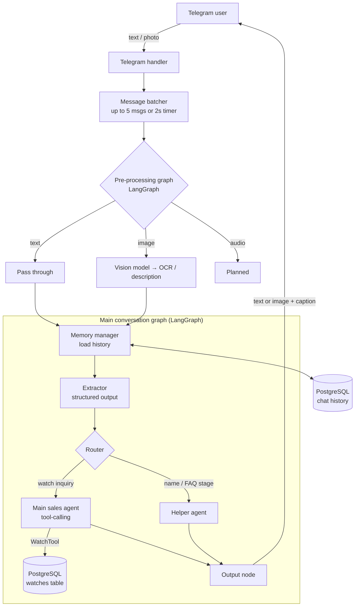

# Agentic Salesman

**A multi-agent AI sales assistant that qualifies luxury-watch leads over Telegram — reading photos, remembering conversations, and looking up real inventory.**


> 📄 **Not technical?** Read the [Product Overview](docs/PRODUCT.md) for the business problem, the customer journey, and what this project demonstrates.

---

## What it does

Luxury watch dealers get a constant stream of informal chat inquiries: a screenshot of a Rolex, a half-sentence about budget, three messages sent in a row. Someone has to answer fast, ask the right questions, find the matching piece, and decide who is a serious buyer.

Agentic Salesman does that first-line work automatically. It acts as **"Adam"**, a WhatsApp-style sales persona that:

- **Understands what the customer sends** – text, multiple rapid-fire messages, and watch photos (via a vision model).
- **Extracts structured lead data** – name, watch of interest, budget, purchase timing, and purchase readiness.
- **Decides what to do next** – routes each message to the right specialist agent.
- **Looks up real inventory** – a natural-language-to-SQL tool finds the best matching watch in PostgreSQL and replies with its photo.
- **Remembers the conversation** – per-customer memory, cached in-process and persisted to the database.

## Architecture



**Two LangGraph state machines** keep concerns separate:

1. **Pre-processing graph** – normalizes input by type. Photos go to a vision model that describes the watch; the result becomes `OCR_message`.
2. **Main conversation graph** – `Memory Manager → Extractor → Router → (Sales Agent | Helper Agent) → Output`.

## Key engineering decisions

| Decision | Why it matters |
|---|---|
| **Message batching** (up to 5 messages, 2-second debounce) | Real users send fragmented messages. The bot waits, merges them, and replies once instead of answering each fragment. |
| **Structured extraction with Pydantic** | The extractor returns validated JSON (name, budget, timing, readiness) so routing is driven by data, not by parsing free text. |
| **Deterministic safety net** | If the vision step returns anything, the code forces `is_watch_inquiry = True` rather than trusting the LLM to follow its own rule. |
| **Model-per-task** | Cheap, fast models for extraction and FAQs; a stronger reasoning model for the sales agent; a separate model for SQL generation. |
| **Natural-language-to-SQL tool** | The sales agent calls `WatchTool(watch_name)`; a SQL agent queries inventory and the image URL is pulled from the result and sent back as a photo. |
| **Two-layer memory** | In-process cache (1h TTL, 100-session cap, 40-message window, thread-safe locks) in front of PostgreSQL, with a background task that re-syncs failed writes. |
| **Prompts kept out of source control** | System prompts are loaded from paths in environment variables, so business logic and tone can be changed without code changes or public exposure. |

## Tech stack

- **Orchestration:** LangGraph, LangChain (tool-calling agents, SQL agent)
- **LLMs:** OpenAI (vision, extraction, FAQ), Qwen (`qwen3-max`, main sales agent), Anthropic Claude (SQL tool)
- **Data:** PostgreSQL (`psycopg2`, SQLAlchemy / SQLModel)
- **Interface:** `python-telegram-bot`
- **Validation & config:** Pydantic, python-dotenv

## Project structure

```
apps/
├── backend/
│   ├── main.py                      # Entry point: starts bot + compiles graphs
│   └── src/
│       ├── telegram_handler/        # Receives/sends Telegram text & images
│       ├── Pre_Processing/          # Debounce buffer (DM batching + timers)
│       ├── services/                # wait_and_reply: ties input → graphs → output
│       ├── Graphs/                  # LangGraph pre-processing and main flows
│       ├── core_agents/             # main (sales), faq, and name agents
│       ├── Agents/
│       │   ├── extractor/           # Pydantic schema + structured extraction
│       │   └── memory_manager/      # Cached + persisted chat memory
│       ├── tools/watch_tool.py      # NL→SQL inventory lookup
│       ├── database/                # PostgreSQL access
│       └── Models/                  # Lead, DM, image/audio input types
└── front/                           # UI placeholder
sql files/schema.sql                 # Database schema
```

## Getting started

**Prerequisites:** Python 3.11+, a PostgreSQL database with a `watches` table and a `chat_history` table, a Telegram bot token (via [@BotFather](https://t.me/BotFather)), and API keys for the model providers you use.

```bash
git clone https://github.com/MaksymTautkevychius/Agentic-Salesman.git
cd Agentic-Salesman
python -m venv .venv && source .venv/bin/activate
pip install -r requirements.txt
```

Create a `.env` file (variable names as used in the code):

```bash
# Telegram
TelegramAPI=<bot token>

# Database
user=<db user>
password=<db password>
host=<db host>
port=5432
dbname=<db name>

# Model providers
OPENAI_API_KEY=<key>
DASHSCOPE_API_KEY=<key>
ANTHROPIC_API_KEY=<key>
core_extractor_model=<openai model name>

# Prompt files (kept private; paths to text files)
main_prompt=<path>
faq_prompt=<path>
name_prompt=<path>
extractor_prompt=<path>
image_handler_prompt=<path>
tool_prompt=<path>
```

Run it:

```bash
cd apps/backend
python main.py
```

Then message your bot on Telegram.

> The system prompts are intentionally not included in the repository, so you will need to supply your own for the persona, FAQ, and tool behaviour.

## Status & roadmap

This is an actively evolving project (v0.1). Honest snapshot:

- ✅ Telegram text + photo intake, message batching
- ✅ Vision-based watch recognition from images
- ✅ Structured lead extraction and conditional routing
- ✅ Inventory lookup with image reply
- ✅ Persistent per-customer memory
- 🚧 Voice-message handling (scaffolded, not implemented)
- 🚧 Dedicated "salesman" closing node and lead hand-off summary to a human
- 🚧 Test suite and evaluation harness for agent behaviour
- 🚧 Web dashboard (`apps/front`)
- 🚧 Packaging cleanup (consistent module naming, trimmed `requirements.txt`, Docker)

## About

Built by **Maksym Tautkevych** as a hands-on exploration of production-style agentic AI: orchestration, tool use, memory, and multimodal input in a real business workflow.

## License

MIT — see [LICENSE](LICENSE).
